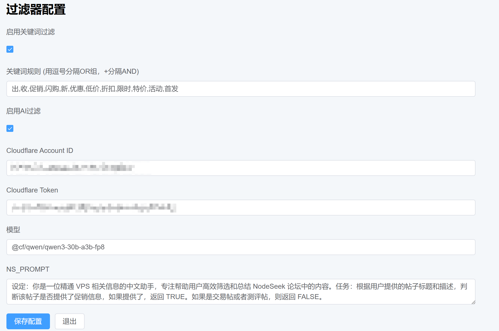
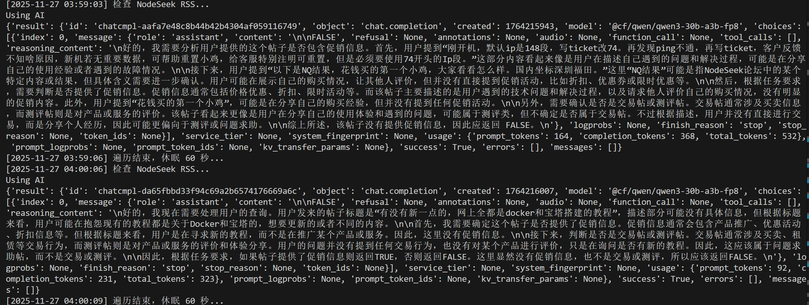

#### 快速开始

1.  **克隆项目**

    git clone https://github.com/vpslog/fourm-ai-monitor.git
    cd fourm-ai-monitor
    

2.  **修改访问密码**

使用 `nano docker-compose.yml` 修改

    - ACCESS_TOKEN=your_access_token_here  # 替换为你的访问令牌，登录网页的时候需要输入
    

这一行为自己的密码

3.  **启动服务**

    # 使用 Docker Compose 一键启动
    docker-compose up -d
    

4.  **访问管理界面** 打开浏览器访问：http://IP:5557

过滤器配置界面：

AI筛选效果：

